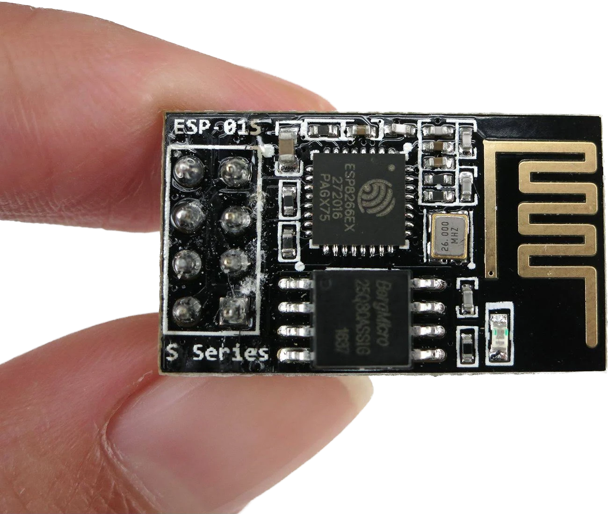

# PillowBiter
Simple countermeasure/annoyance to Mike Lindell's Wireless Monitoring Device (WMD) using the Arduino platform and an ESP8266.

Uses wifi beacon frames to project numerous wifi access points that identify as election machine devices.

Tested with a 99¢ ESP01S and Arduino IDE 2.1.1

(WARNING: This is a novelty and for demonstration purposes only. It is recommended you DO NOT take this to polling places.)
