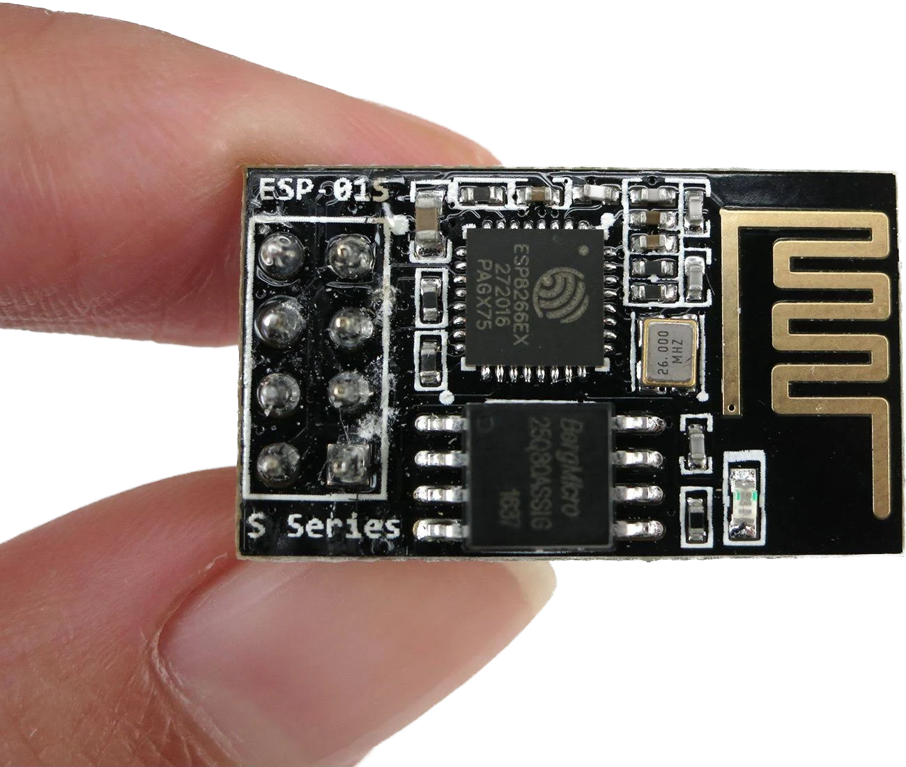
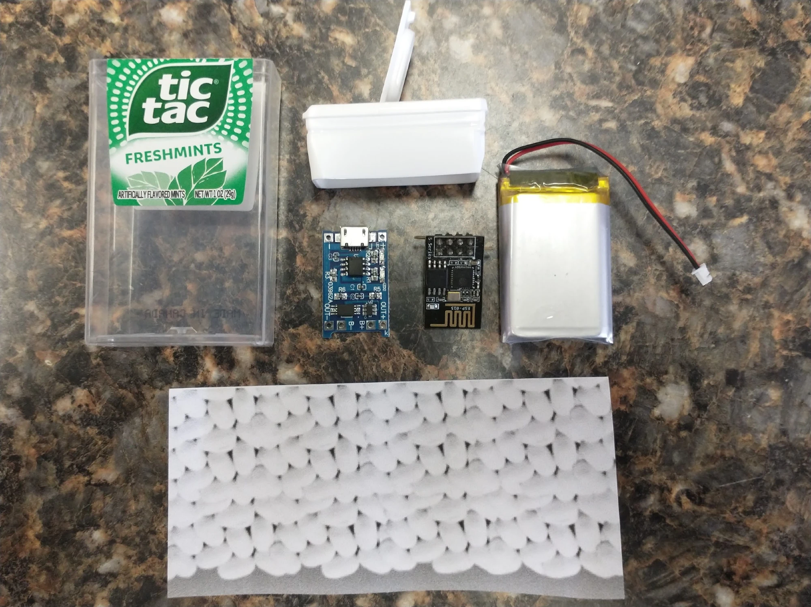

# PillowBiter
Simple countermeasure/annoyance to Mike Lindell's Wireless Monitoring Device [1] [2] [3] [4], using the Arduino platform and an ESP8266.

Assembles and transmits wifi beacon frames to project numerous wifi access points that identify as election machine devices.

Tested with a 99¢ ESP01S and Arduino IDE 2.1.1

(WARNING: This is a novelty and for demonstration purposes only. It is recommended you DO NOT take this to polling places.)

[1]: https://www.yahoo.com/news/no-actual-ohio-election-officials-030014681.html
[2]: https://abcnews.com/US/election-officials-push-back-security-device-distributed-mike/story?id=104541850
[3]: https://lailluminator.com/2023/08/18/my-pillow-drone/
[4]: https://www.news-leader.com/story/news/politics/2023/08/18/how-mypillow-ceo-mike-lindell-wants-to-secure-us-elections/70619001007/
